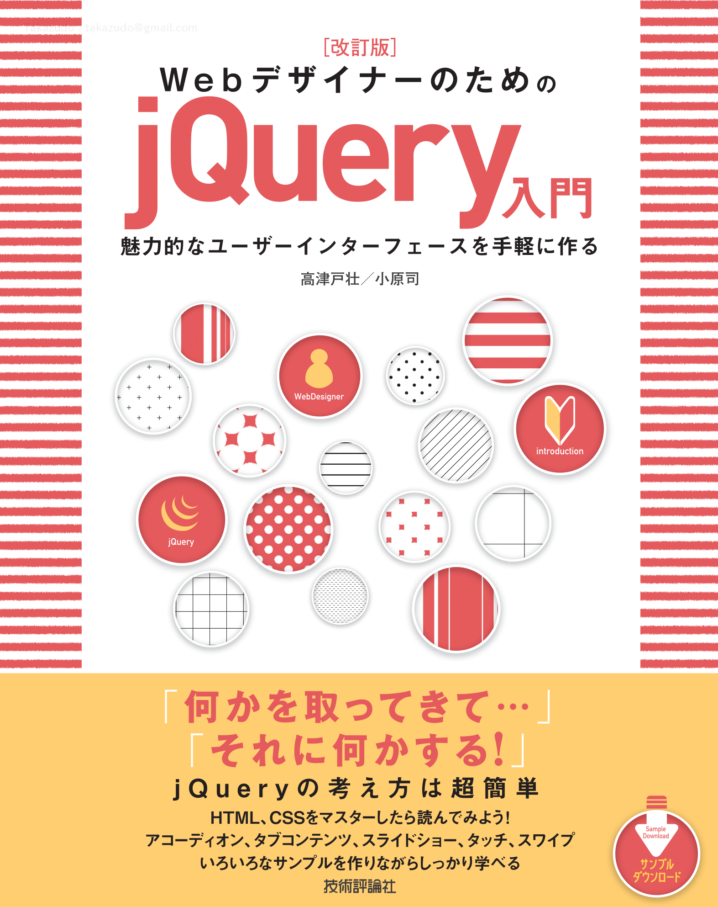
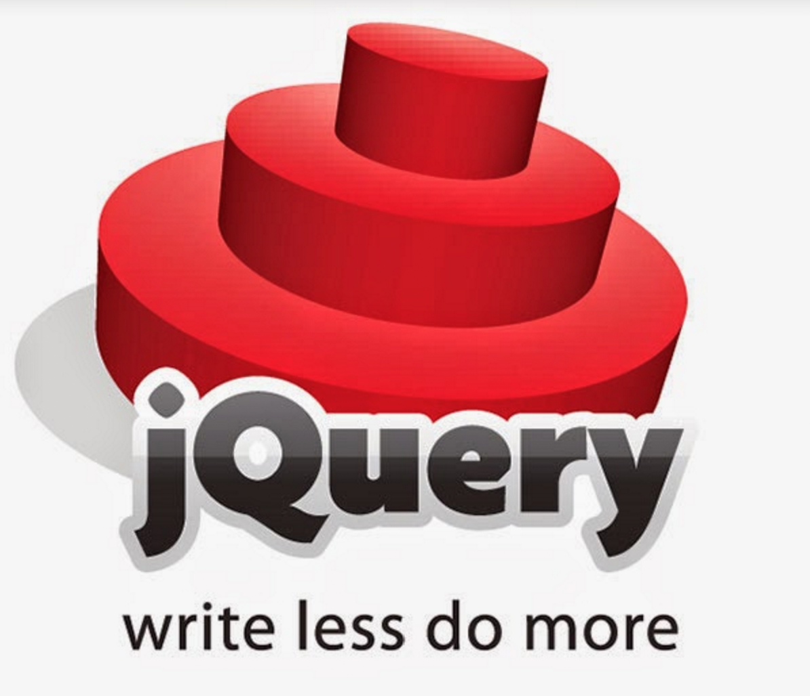
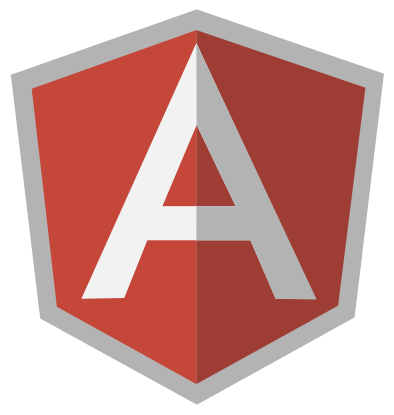
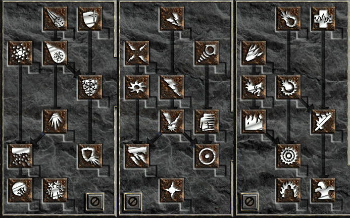

<h1 style="font-size:4em">JavaScript<br>開発の変遷</h1>

<p style="margin-bottom:0;padding-bottom:0">高津戸壮 <a href="https://twitter.com/Takazudo">@Takazudo</a></p>

----

## 自己紹介

<div style="display:table; width: 100%">
<div style="display:table-cell; vertical-align:middle; width:65%; vertical-align:top; padding:30px 0 0">
<ul>
<li>高津戸壮 (たかつど たけし)</li>
<li><a href="http://www.pxgrid.com/">株式会社ピクセルグリッド</a></li>
<li>フロントエンドエンジニア</li>
<li><a href="twitter.com/Takazudo">@Takazudo</a></li>
</ul>
</div>
<div style="display:table-cell; vertical-align:middle; width:35%"></div>
</div>

---

<a href="https://www.amazon.co.jp/dp/4774169447"></a>

----

## 私の履歴

* 高校〜大学: Webサイト作り趣味的な
* 大学卒業後: ちょっとだけフリーランス
* Web制作会社に就職（約3年間）
* フリーランス（約1年間）
* 今の会社の代表が会社作るというので<br>社員となり7年経ったのが今

----

## 今日お話する内容

* あくまで主観的な一制作者視点からの<br>JavaScriptの歴史
* ずっとHTML+CSS+JS書いてきた人が私
* JavaScriptは昔どうだったのか
* JavaScriptは今どうなっているのか

----

## 高校生の頃（2000年頃）


---

* HTMLタグ辞典
* ダイナミックHTML
* IE6（2001年リリース）
* Web日記
* 掲示板
* CGIゲーム

----

## Dynamic HTMLとは

<p style="text-align:left">Dynamic HTMLは、Microsoft® Internet Explorer 4.0の革新的な機能の1つである。Dynamic HTMLにより、オーサーはドキュメントのレンダリングとコンテントを動的に変更でき、視覚的に優れたHTMLドキュメントを作成できる。</p>

* [MSDN - Dynamic HTML](https://msdn.microsoft.com/ja-jp/library/cc409712.aspx)

---

* ダイナミックスタイル
* ダイナミックコンテント
* 位置指定とアニメーション
* フィルタとトランジション
* Dynamic HTMLオブジェクトモデル

---

## JavaScript使ってた？

* ブラウザ独自実装が多い時代
* IEでは…Netscapeでは…
* テーブルレイアウト時代
* CSSを使ってやろうという感じでもまだない
* JavaScriptを使って何をしようという<br>ビジョンがそんなに無いし、必要でもない

----

## その頃のJavaScript

### [MM_Swapimage](http://www.allaboutcoding.com/tutorials/javascript/image_roll_over.asp)

* 画像のロールオーバー
* Macromedia(MM) Dreamweaverについてた
* IE4とか
* Netscape Communicator 4.8とか

---

```html
<body onLoad="MM_preloadImages('rollover.jpg')">
  <a href="#"
    onMouseOut="MM_swapImgRestore()"
    onMouseOver="MM_swapImage('TestImage','','rollover.jpg',1)">
    
  </a>
</body>

```

HTMLの外に出すことすら難しい

----

## その頃のFlash


---

* 動きのあるものはFlash
* カッコイイものといえばFlash
* 凝ったUIといえばFlash
* JavaScriptでそういったものが<br>できるという発想は誰もしてない

----

## Web制作会社就職

* 2005年頃
* HTMLテンプレを書く日々
* 徐々にテーブルからCSSにシフト
* JavaScriptは社内ライブラリ
* 画像のロールオーバー
* window.open
* フォームのバリデーション
* スムーズスクロール

---

### window.open


---

* ブラウザごとに開くポップアップのサイズに差がある
* IE4, 5, 5.5, Nescape4.8, 6, 7, Mac IE5...
* その差を補正するライブラリ
* 拡大画像などもこの頃はポップアップで開いていた

---

### フォームのバリデーション


---

* そんなに沢山実装した記憶は無い
* 基本はサーバーサイドでバリデーション
* 今のように便利なライブラリなど<br>無かったので頑張って書いてた

---

## スムーズスクロール

* [こういうもの](https://github.com/Takazudo/jQuery.tinyscroller)
* setTimeoutで終点の距離に近づくほどスクロール距離を縮めるアルゴリズム
* 初めてまともにJavaScriptを読み勉強になった思い出

----

## その頃のブラウザ事情

 

* IE6: 2001
* IE7: 2006 ←
* IE8: 2009 ←

---

この頃のシェアは圧倒的にIE

新しいブラウザが出ても、<br>依然として古いブラウザも使われ続ける時代。<br>ブラウザが頑張って新しい何かを<br>実装しようとも制作者的には使えない……

IE5.5, IE6, IE7, Netscape7, MacIE5…

----

## [prototype.js](http://prototypejs.org/) 流行る


---

* wikepediaによれば、2015年11月でも全Webサイトの2.2%で使われていたという[調査](https://en.wikipedia.org/wiki/Prototype_JavaScript_Framework)があるとか
* クラスベースの設計、継承も
* Class.create

---

```js
var Person = Class.create();
Person.prototype = {
  initialize : function(name) {
    this.name = name;
  },
  exec : function() {
    var str = this.name;
    alert('MY NAME IS '+str.toUpperCase());
  }
};

var person = new Person;
```

---

* Ruby的な便利機能ら any, max, min, find, each
* Ajax
* $(idString)
* prototype汚染だった点も話題に

----

## [script.aculo.us](http://script.aculo.us/)


---

* web 2.0 javascript
* prototype.js依存のUI効果ライブラリ
* 色々詰め合わされている
* サイトにデモ多数

---

フェードで登場

```js
$('id_of_element').appear();
$('id_of_element').appear({ duration: 3.0 });
```

dragできる

```js
new Draggable('drag_demo_3', { scroll: window });
```

---

* しかしそこまで流行ってはいない
* 結局この時代でかっこいいものはFlash
* クラスベースの設計も、活かす機会が少ない

----

## Web2.0

* [IT用語辞典 - Web 2.0とは](http://e-words.jp/w/Web_2.0.html)
* Webがプラットフォーム
* BlogとかSNSとか
* ユーザーが参加して集合知
* ロングテール
* Ajaxのような技術でUIも変化

----

## Googleのすごいやつ

 

---

* 2004年 Gmailベータ版サービス開始
* 2006年 招待制からサインアップ制に
* 2008年 Webメール利用者調査<br>Yahoo!メール／gooメール／Gmail
* 2005年 Google mapsベータ版サービス開始
* 2007年 Google maps日本語対応

ちょっとずつJavaScriptに注目が集まってくる

----

## 一方その頃現場では…

```js
var div = document.getElementById('div1');

if(div.addEventListener){
  div.addEventListener('click', doSomething, false);
}else if(div.attachEvent){
  div.attachEvent('onclick', doSomething);
}

function doSomething(){
  alert('クリックされました');
}
```

ブラウザの差異に苦しむ日々

----

## [jQuery](http://jquery.com/)登場



---

* 2006年 jQuery1.0リリース
* jQueryオブジェクト
* 簡単にDOMを操作することができるように
* ブラウザ差異の苦しみを大きく軽減

---

## jQueryプラグイン

* リッチなUIを簡単に実装できるように
* プラグイン作成が容易
* 使うのも簡単
* 豊富なプラグインがjQueryの普及へつながる
* WebサイトのUIもリッチに

---

```js
$('#something').gallery();
```

* [Lightbox](http://lokeshdhakar.com/projects/lightbox2/)
* [ThickBox](http://codylindley.com/thickbox/)
* [ギャラリー](http://1stwebdesigner.com/jquery-gallery/)
* [jQuery UI](https://jqueryui.com/)
* [Masonry](http://masonry.desandro.com/)

----

## この頃の私

* このままではずっとHTMLテンプレを<br>書き続けることになる
* もっと勉強せねばと思い、<br>フリーランスを経て今の会社に
* ちょっとしたUIをライブラリに<br>まとめて公開したりなどしてた

----

## iPhone, iPadの登場


---

* 2009年 iPhone 3GS
* 2010年 iPad
* Flashが動かない…
* Flashで作っていたものは<br>JSで作られるようになってくる
* touchevent

----

## Aptana Jaxer

* 2008年
* そんな有名なわけではないですが…
* サーバーサイドJavaScript
* 話題性だけで全く流行らず開発が終わった
* DBいじるのとか大変だった（ActiveJS）
* ライブラリがほぼ無い

----

## [Backbone.js](http://backbonejs.org/)


---

* JSでできることは増えた
* jQueryはDOMをいじるのに長けている
* しかしJSでどうWebアプリを設計するか
* Model Collection View Router<br>で設計する薄いフレームワーク
* Ruby的な便利メソッド集 [Underscore.js](http://underscorejs.org/)<br>`each`, `map`, `reduce`, `without`…

---

* Model: データを管理する
* Collection: Modelの集合を管理する
* View: 表示を管理する
* Router: hashchangeを利用したURLルーティング

---


Webアプリケーションをいかに<br>設計するかという点に注目が集まっていく

* [Developing Backbone.js Applications](https://addyosmani.com/backbone-fundamentals/)


----

## [CoffeeScript](http://coffeescript.org/)


---

* JSのコードに変換できる言語
* `{}`の省略、`@`、class構文等

---

```coffeescript
doSomething = ->
   msg = 'foo!'
   alert msg
   true
```

```js
var doSomething = function() {
    var msg = 'foo!';
    alert(msg);
    return true;
};
```

---

```coffeescript
class Animal
  constructor: (name) ->
    @name = name
  bark: ->
    alert 'わんおわんお'
    @
  walk: ->
    alert 'てけてけ'
    @
 
animal = new Animal
animal.bark() # アラート: わんおわんお
animal.walk() # アラート: てけてけ
```

---

```js
var Animal, animal;

Animal = (function() {
  function Animal(name) {
    this.name = name;
  }
  Animal.prototype.bark = function() {
    alert('わんおわんお');
    return this;
  };
  Animal.prototype.walk = function() {
    alert('てけてけ');
    return this;
  };
  return Animal;
})();

animal = new Animal;
animal.bark(); // アラート: わんおわんお
animal.walk(); // アラート: てけてけ
```

---

* ベストプラクティス的な内容を言語にした感じ
* 開発環境にも変化が生まれだす

----

## [Node.js](https://nodejs.org/en/)


---

* 2009年リリース
* サーバーサイドで動くJS
* チャット等の大量のアクセスを<br>さばくのが得意（らしい）※
* パッケージマネージャ npm
* npmモジュールが非常に充実

<p style="font-size:.7em">※サーバーサイドには詳しくありませんスミマセン…</p>

----

## [Grunt](http://gruntjs.com/), [gulp](http://gulpjs.com/)


---

* タスクランナー
* これまではRubyやMakefile等でやっていた
* JSでタスクが手軽に書けるので<br>フロントエンド界隈に広まる

---

* minify
* imagemin
* concat
* Sass
* CoffeeScript
* httpサーバー

----

## ユニットテスト

* ユニットテストの環境も充実した
* タスクランナーの力を得て<br>開発に容易に組み込めるように
* [QUnit](https://qunitjs.com/)
* [mocha](https://mochajs.org/)
* [Karma](http://karma-runner.github.io/1.0/index.html)

----

## ECMAScript（ES）

* JSの元になっている仕様
* ES3: 1999年
* ES4: まとまらず破棄。ActionScriptが一部引き継ぐ
* ES5: 2009年
* ES2015(6): 2015年
* ES2016: 2016年

---

## ES5 - getter, setter

```js
var man = {
  _firstName: 'Bill',
  _lastName: 'Gates',
  _age: 20,
  get fullName() {
    console.log('fullName get!');
    return this._firstName + this._lastName;
  },
  set age(num) {
    console.log('age set!');
    this._age = num;
  }
}
```

```js
man.fullName; // fullName get! "BillGates"
man.age = 100; // age set!
man; // {_firstName: "Bill", _lastName: "Gates", _age: 200}
```

---

## ES5 - JSON

```js
var result = JSON.parse('{"bar":"foo"}');
console.log(result); // Object {bar: "foo"}
```

```js
var result = JSON.stringify({bar: "foo"});
console.log(result);//"{"bar":"foo"}"
```

---

## ES2015 - class

```js
/* Catクラス */
 
class Cat {
  constructor(name) {
    this.name = name;
  }
  set name(name) {
    this._name = name;
  }
  get name() {
    return this._name;
  }
  walk() {
    console.log(this._name + 'が歩いてます');
  }
}
```

---
 
```js
/* Catクラスのインスタンス作成 */
 
var cat1 = new Cat('タマ');
var cat2 = new Cat('コタロー');
cat1.walk(); // タマが歩いています
cat2.walk(); // コタローが歩いています
```

---

## ES2015 - Promise

```js
getApiData(function(data) {
  tweakData(data, function(tweakedData) {
    updateView(tweakedData);
  }, notifyError);
}, notifyError);
```

```js
var promise = getApiData();

getApiData()
  .then(tweakData)
  .then(updateView)
  .catch(notifyError);
```

---

```js
var getApiData = function() {
  return new Promise(function(resolve, reject) {
    // API1にアクセス
    doAjaxStuff({
      success: function(data) { // 成功した場合
        resolve();
      },
      fail: function() { // エラー発生時
        reject({ message: 'APIにアクセスできませんでした' });
      }
    });
  });
};
```

----

## [Babel](https://babeljs.io/)


---

* Babel is a JavaScript compiler.
* Use next generation JavaScript, today.
* ES2015(6)以降のコードをES5のコードに変換する
* Gruntやgulpで手軽に導入可能
* これまで: 旧ブラウザがいるから結局書けない
* これから: 新しい仕様で書いてBabelで変換

----

## データバインディング

* Webアプリの設計方法にも変化が
* オブザーバーパターンの応用
* データが変わったら勝手に<br>対応する表示が更新されるという設計のパターン
* [AngularJS](https://angularjs.org/), [React.js](https://facebook.github.io/react/), [Vue.js](https://jp.vuejs.org/)…

---

### オブザーバーパターン

```js
var book = new Backbone.Model({
  title: 'すごくない本'
});

model.get('title'); // すごくない本

/* 値の変化を監視 */
book.on('change:title', function() {
  console.log('title変わりました');
});

model.set({ title: 'すごい本' }); // title変わりました！

model.get('title'); // すごい本
```

---

* 複雑なWebアプリケーションでは、<br>無数のモジュールが連動する
* モジュールらをどう組み合わせるか
* 自動化できるところはフレームワークにやらせてしまう

----

## [AngularJS](https://angularjs.org/)



---

* 2009年リリース
* by Google
* データバインディング
* データが変更されたら勝手に表示が変わる
* DOMのイベント拾ってデータが勝手に変わる

---

```html
<div ng-controller="MainCtrl">
  <input type="text" ng-model="myName">
  <h1>{{myName}}</h1>
</div>
```

```js
angular.module('searchApp', [])
  .controller('MainCtrl', function($scope) {
    $scope.myName = 'Takazudo';
  });
```

* [デモ](http://plnkr.co/edit/Wz0UWdXaHvmdJT6iWkGi?p=preview)

---

* DOM操作、イベントハンドリングが省略できる
* Webアプリを設計したいのであって、<br>DOMをいじりたいわけではない
* ロジック部分の設計に集中できるとも言えるかも
* AngularJSの設計方法に習う必要がある

----

## jQueryのイマ

* 約80%のWebサイトで使われているという[調査](http://trends.builtwith.com/javascript/jQuery)あり
* ちょっとしたUIを作る場合には依然便利
* しかし複雑なUI、Webアプリのためには足りない
* それらを実装するのに有用なフレームワークが増えた
* Webアプリ開発においては使用頻度が落ちているはず

----

## フロントエンドエンジニア

* [Professional Frontend Engineering](http://www.slideshare.net/natekoechley/professional-frontend-engineering)
* 2008年のYahoo!のデベロッパーのプレゼン
* やることが昔と比べて増えたよ
* フロントの実装がビジネスの寿命を左右するよ

---

## 時は流れ…

* フロントエンドの技術領域はより広く深くなった
* Webアプリでもプッシュ通知が受信可能に
* ビジュアル表現はcanvasやWebGLで可能に
* 何を選び、どう特化するか？

---



----

<a href="http://www.codegrid.net/"></a>

----

# ありがとう<br>ございました

